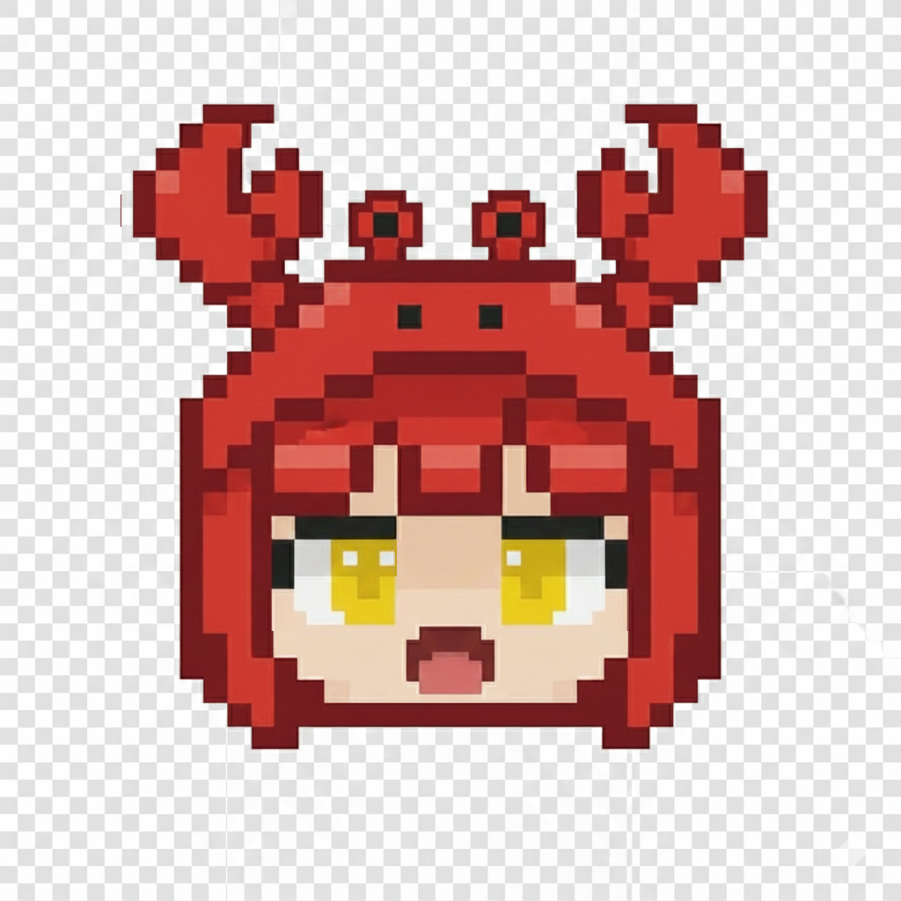

<p align="center">
  
</p>

<h1 align="center">🦞 Clawgirl</h1>

<p align="center">
  <a href="https://github.com/openclaw/openclaw">OpenClaw</a> AI 智能体的 macOS 原生桌面伴侣<br>
  语音唤醒 · 实时对话 · 语音合成
</p>

<p align="center">
  
  
  
  
</p>

> 像和朋友聊天一样跟你的 AI 智能体对话。说出唤醒词，自然地说话，然后听到回复被朗读出来。

[English](README.md) | 中文

## ✨ 功能特性

- **🎤 语音唤醒词检测** — 说"小虾"（或任意自定义唤醒词）即可免手动激活语音输入，基于 Silero VAD + WhisperKit
- **🗣️ 语音转文字** — 基于 [WhisperKit](https://github.com/argmaxinc/WhisperKit) 的端侧语音识别（无需云端 API），配合 Silero VAD 智能停止检测
- **🔊 文字转语音** — AI 回复自动朗读，支持配置 macOS 系统语音
- **💬 实时对话** — 通过 WebSocket 连接 OpenClaw 网关，支持流式响应
- **🖼️ 图片支持** — 拖拽或粘贴图片随消息发送
- **🌊 精美界面** — 海洋蓝主题，状态感知动画（待机水波、聆听波形、思考弹跳、说话声浪）
- **⌨️ 自定义快捷键** — 默认 `⌘D` 语音输入、`⌘E` 唤醒开关（可在设置中自定义）。支持组合键、单键和纯修饰键（如 `⌥`）
- **📊 加载指示器** — 启动时显示模型加载进度
- **🔒 麦克风权限** — 首次使用时明确请求权限
- **⚙️ 全面可配置** — 网关地址、Token、会话、唤醒词、模型路径、TTS 语音 —— 全部可在设置面板中调整

## 📋 系统要求

- **macOS 14.0+**（Sonoma 或更高版本）
- **Apple Silicon**（M1/M2/M3/M4）—— WhisperKit CoreML 模型需要
- **Xcode 16+** —— 编译项目
- **[OpenClaw](https://github.com/openclaw/openclaw)** —— 在本机或网络中运行的网关服务

## 🚀 快速开始

### 1. 克隆仓库

```bash
git clone https://github.com/MrRRRabbit/clawgirl.git
cd clawgirl
```

### 2. 下载 WhisperKit 模型

Clawgirl 使用 WhisperKit 进行端侧语音识别，需要先下载 CoreML 模型：

```bash
# 安装 huggingface-cli（如果没有的话）
pip install huggingface_hub

# 下载模型（small 用于唤醒词，large-v3 用于语音转写）
huggingface-cli download argmaxinc/whisperkit-coreml \
  --include "openai_whisper-small/*" "openai_whisper-large-v3/*" \
  --local-dir ~/Documents/huggingface/models/argmaxinc/whisperkit-coreml
```

> **💡 提示：** 国内用户可使用镜像加速下载：
> ```bash
> HF_ENDPOINT=https://hf-mirror.com huggingface-cli download argmaxinc/whisperkit-coreml \
>   --include "openai_whisper-small/*" "openai_whisper-large-v3/*" \
>   --local-dir ~/Documents/huggingface/models/argmaxinc/whisperkit-coreml
> ```

> **💡 提示：** 如果希望更快启动且不需要高精度转写，可以只下载 `openai_whisper-base` 或 `openai_whisper-small`。App 会自动降级使用较小的模型。

### 3. 编译运行

在 Xcode 中打开 `Clawgirl.xcodeproj`，然后：

1. 等待 Swift Package Manager 拉取依赖（WhisperKit + RealTimeCutVADLibrary）
2. 选择你的 Mac 作为运行目标
3. 按 `⌘R` 编译并运行

### 4. 配置

点击 App 中的 ⚙️ 齿轮图标进行配置：

| 设置项 | 说明 | 默认值 |
|--------|------|--------|
| **网关地址** | OpenClaw 网关 WebSocket 地址 | `ws://127.0.0.1:18789` |
| **网关 Token** | 认证令牌，来自 `~/.openclaw/openclaw.json` | 自动检测 |
| **会话 Key** | 连接到 OpenClaw 的哪个 session | `main` |
| **模型路径** | WhisperKit CoreML 模型存储目录 | `~/Documents/huggingface/models/argmaxinc/whisperkit-coreml` |
| **唤醒词** | 触发语音输入的关键词 | 小虾、小夏、小瞎 等 |
| **TTS 语音** | 文字转语音的声音（从 macOS 系统语音中选择） | Tingting（内置） |

> **注意：** 网关 Token 会在首次启动时自动从本地 OpenClaw 配置文件（`~/.openclaw/openclaw.json`）读取。只有连接远程网关时才需要手动设置。

> **注意：** 连接设置（网关地址、Token、会话）修改后需要重启 App 才能生效。

## 🎙️ 语音唤醒工作原理

```
┌─────────────┐     ┌──────────────┐     ┌──────────────┐     ┌──────────┐
│  持续监听     │     │  🔔 提示音    │     │  🎤 录制语音  │     │  📤 发送  │
│  (Silero VAD │────▶│  (Glass.aiff)│────▶│  (large-v3)  │────▶│  消息    │
│  + small 模型)│     └──────────────┘     └──────────────┘     └──────────┘
└─────────────┘                                 │                    │
       │                                  Silero VAD            🔔 Submarine
       │ 说"小虾"                        自动停止 (~3s)           提示音
       ▼                                        ▼                    ▼
  Silero VAD 检测人声               WhisperKit large-v3         AI 回复
  → WhisperKit small               （完整语音转写）              并朗读
  （仅匹配唤醒词，不发送）
```

1. **待机** — Silero VAD（神经网络）持续监测麦克风；检测到人声时，用 WhisperKit `small` 模型检查是否为唤醒词
2. **唤醒** — 检测到唤醒词 → 播放 Glass 提示音 → 等待 500ms
3. **录音** — 录制语音，由 Silero VAD 自动停止（~3 秒静音检测，基于神经网络）
4. **发送** — 用 WhisperKit `large-v3` 转写 → 播放 Submarine 提示音 → 发送到 OpenClaw
5. **回复** — AI 响应流式传入 → 显示在聊天记录中 → 通过 TTS 朗读
6. **恢复** — 返回唤醒词监听状态

## ⌨️ 快捷键

在 App 内按 `⌘/` 或点击 ⌨️ 图标查看所有快捷键。

| 快捷键 | 功能 | 可自定义 |
|--------|------|:---:|
| `⌘ D` | 语音输入（按一次开始录音，再按一次发送） | ✅ |
| `⌘ E` | 开启/关闭唤醒词监听 | ✅ |
| `⌘ V` | 粘贴图片 | |
| `⌘ /` | 显示快捷键帮助 | |
| `Enter` | 发送文字消息 | |
| `Shift + Enter` | 换行 | |

> **提示：** 可以在 ⚙️ 设置面板中自定义语音输入和语音唤醒的快捷键。支持的格式：组合键（`⌘D`、`⌃⇧E`）、单键（`F`）和纯修饰键（`⌥`）。

## 🎨 状态动画

App 根据当前状态在头像下方显示不同的动画效果：

| 状态 | 动画 | 颜色 |
|------|------|------|
| 🌊 待机 | 水波纹扩散 | 海洋蓝 |
| 👂 聆听 | 跳动音频条 | 青绿色 |
| 🤔 思考 | 弹跳圆点 | 暖沙色 |
| 🗣️ 说话 | 脉冲声浪条 | 珊瑚色 |
| ❌ 错误 | 红色脉冲 | 红色 |

## 📁 项目结构

```
clawgirl/
├── Clawgirl.xcodeproj/
├── Clawgirl/
│   ├── ClawgirlApp.swift          # App 入口
│   ├── ContentView.swift           # 主 UI + 设置面板
│   ├── ChatManager.swift           # 核心逻辑：对话、TTS、WebSocket、WhisperKit、Silero VAD
│   ├── WakeWordDetector.swift      # 唤醒词检测：Silero VAD + WhisperKit small
│   ├── DebugLog.swift              # 调试日志工具（控制台 + 文件）
│   ├── Info.plist                  # App 权限（麦克风）
│   ├── Clawgirl.entitlements       # 音频输入权限
│   └── Assets/                     # 头像表情图片
│       ├── idle.png
│       ├── idle_blink.png
│       ├── listening.png
│       ├── thinking.png
│       ├── speaking_1.png
│       └── speaking_2.png
└── README.md
```

## 🔧 常见问题

### App 显示"正在加载语音模型..."
WhisperKit CoreML 模型在首次启动时需要编译，耗时：
- **small 模型**（唤醒词）：约 30 秒
- **large-v3 模型**（语音转写）：约 2.5 分钟

后续启动会快很多（编译后的模型会被缓存）。

### 菜单栏没有麦克风图标
App 需要麦克风权限。如果系统提示没有弹出：
1. 打开 **系统设置 → 隐私与安全性 → 麦克风**
2. 启用 Clawgirl

### TTS 语音听起来很机械
Clawgirl 默认使用 **Tingting**（内置精简语音）。如需更好的音质，可以下载高级语音：
1. 打开 **系统设置 → 辅助功能 → 朗读内容 → 系统语音 → 管理语音...**
2. 搜索 "Wing"（中文 - 香港）并点击下载
3. 也可以下载其他高级/增强语音以获得更好的音质

未安装高级语音时，App 会自动降级使用内置精简语音 —— 可以正常使用，但听起来不够自然。

### 唤醒词无法检测
- 确认 👂 耳朵图标处于激活状态（青绿色）
- 检查 ⚙️ 设置面板中唤醒词模型状态是否为 🟢
- 默认唤醒词"小虾"（及变体 小夏/小瞎）识别准确率最高
- 正常音量清晰说话即可 — Silero VAD 对轻声说话也有良好的识别能力
- 戴耳机可能会降低麦克风灵敏度

### 提示"已损坏"或无法打开
对于未签名的构建，运行：
```bash
xattr -cr /path/to/Clawgirl.app
```

### 网关连接失败
- 确保 OpenClaw 网关正在运行（`openclaw gateway status`）
- 检查 ⚙️ 设置中的网关地址和 Token
- 默认网关端口为 `18789`

## 🤝 致谢

- [OpenClaw](https://github.com/openclaw/openclaw) — AI 智能体框架
- [WhisperKit](https://github.com/argmaxinc/WhisperKit) — Apple Silicon 端侧语音识别
- [RealTimeCutVADLibrary](https://github.com/sakits/RealTimeCutVADLibrary) — Silero VAD v5 语音活动检测
- 由一只龙虾娘 🦞 用 ❤️ 构建

## 📄 许可证

MIT
